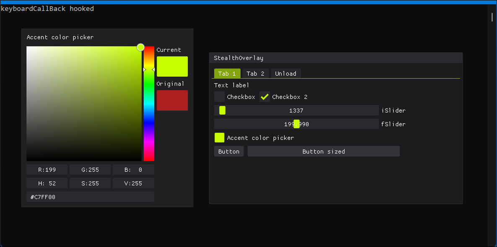

# StealthOverlay - D3D11 ImGui overlay
  

### StealthOverlay is a lightweight and stealthy ImGui-based overlay using DirectX 11.
An ideal base for building external tools or GUI-driven utilities that require drawing over other applications, including games.
##### Full project files are included for quick setup and seamless compilation.

# ✨ Features
- 🔒 Streamproof — Invisible in OBS, Medal, and most screen capture software
- 🎹 Keyboard Hook — Basic hook for global keystroke listening
- 🖼️ Universal Overlay — Draws on top of any window or game (leveraging uiaccess)
- 🔤 Custom Font Support — FreeType-enabled with [Pixeloid](https://www.dafont.com/pixeloid-sans.font) included

# 📦 Built With
- [ImGui-1.91.9b](https://github.com/ocornut/imgui/tree/v1.91.9b)
- [DirectX SDK June 2010](https://www.microsoft.com/en-us/download/details.aspx?id=6812)
- DirectX11

# 🧠 Credits
- killtimer0 - [uiaccess](https://github.com/killtimer0/uiaccess)
- JustasMasiulis - [xorstr](https://github.com/JustasMasiulis/xorstr)
